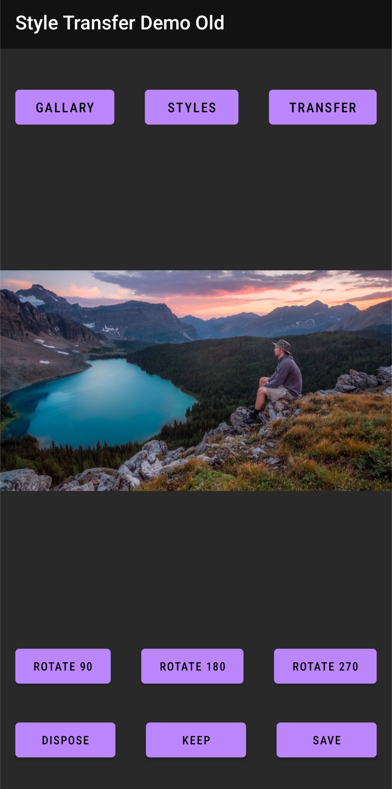

# Fast Style Transfer - Android App

A native Android application implementing Fast Neural Style Transfer for artistic image transformation on mobile devices. Built with custom TensorFlow optimizations and efficient on-device inference.

## 📱 Demo Download

**[Download APK](https://drive.google.com/file/d/1p2EiFJwj-Kb1JNajI53swNCfc7yeaXE1/view?usp=sharing)** - Working demo for Android devices

*Note: Enable "Install from unknown sources" in your Android settings*

## ✨ Features

- **Real-time Style Transfer**: Transform photos with artistic styles inspired by famous painters
- **Multiple Art Styles**: Van Gogh, Picasso, and other artistic styles available
- **100% On-Device Processing**: All inference runs locally - no network required, no data uploaded
- **Dynamic Input Support**: Handles variable image sizes without predefined tensor dimensions
- **Custom Model Optimization**: Hand-tuned for mobile hardware constraints
- **Intuitive UI**: Clean, user-friendly interface with gallery integration
- **Performance Optimized**: ~4-5 second inference time on modern devices

## 🖼️ App Screenshots & Flow

### Main Interface

### Gallery Open

### Photo Selection

### Style Selection

### Processing

### Results

*Inference time: ~4.3 seconds on test device*

## 🛠️ Technical Implementation

### Architecture Overview
- **Framework**: Native Android with TensorFlow Lite
- **Model**: Custom Fast Neural Style Transfer implementation
- **Optimization**: TensorFlow C_API integration for performance
- **UI**: Modern Android Architecture Components

### Key Technical Features
- **Custom Architecture**: Redesigned Fast Neural Style Transfer network optimized for mobile deployment
- **Ultra-Lightweight Model**: Reduced to only 210,000 parameters through architectural innovations
- **Dynamic Input Handling**: Supports variable image dimensions without predefined tensor sizes
- **Custom TensorFlow Inference**: Hand-written inference pipeline bypassing TensorFlow Lite API limitations
- **100% Offline Processing**: Complete on-device inference - no network connection required
- **Individual Style Training**: Each artistic style trained from scratch for optimal quality
- **Android NDK Integration**: Native C/C++ components for performance-critical operations
- **Privacy-First Design**: Zero data upload - all processing stays on your device

### Performance Optimizations
- Model size optimization for mobile deployment
- Custom inference pipeline reducing overhead
- Memory-efficient image processing
- Hardware-specific optimizations

## 🔧 Technical Stack

- **Languages**: Java, C++, Python (training)
- **Frameworks**: Android SDK, TensorFlow, TensorFlow Lite
- **Native Development**: Android NDK, JNI
- **Model Training**: TensorFlow (Python)
- **Build Tools**: Gradle, CMake

## 📱 System Requirements

- **Android Version**: 6.0 (API level 23) or higher
- **RAM**: Minimum 3GB recommended
- **Storage**: 50MB for app + processing space
- **Permissions**: Camera, Storage access

## 🚀 Installation & Usage

### From APK
1. Download the APK from the link above
2. Enable "Install from unknown sources" in Android settings
3. Install the downloaded APK
4. Grant necessary permissions (camera, storage)

### Using the App
1. **Gallery**: Select a photo from your device or take a new one
2. **Styles**: Choose from available artistic styles
3. **Transfer**: Apply the selected style to your image
4. **Save/Share**: Keep your artistic creation or share it

## 🎨 Available Styles

The app includes various artistic styles inspired by:
- **Van Gogh**: Starry night and post-impressionist styles
- **Picasso**: Cubist and abstract interpretations
- **Abstract Art**: Modern artistic transformations
- **Classical Paintings**: Various historical art movements

## ⚡ Performance Metrics

- **Inference Time**: 4-5 seconds (average)
- **Model Size**: Optimized for mobile deployment
- **Memory Usage**: Efficient resource management
- **Compatibility**: Tested on Android 6.0+

## 🔬 Technical Deep Dive

### Model Architecture
The app implements a custom Fast Neural Style Transfer architecture, redesigned from the original paper with significant optimizations for mobile deployment. Through architectural innovations and careful network design, the model achieves high-quality style transfer with only 210,000 parameters - a dramatic reduction from typical implementations while maintaining visual quality.

### Mobile Optimization Strategy
- **Custom Architecture Design**: Redesigned Fast Style Transfer architecture from scratch
- **Parameter Reduction**: Optimized network to only 210,000 parameters through architectural innovations
- **Per-Style Training**: Individual model training from scratch for each artistic style
- **Memory Management**: Efficient buffer handling for mobile constraints

### Android Integration
- **Custom TensorFlow C_API Implementation**: Direct native integration bypassing TensorFlow Lite limitations
- **Dynamic Tensor Handling**: Support for variable input dimensions without predefined sizes
- **Zero Network Dependencies**: Complete offline functionality - no server communication
- **Privacy-Focused Architecture**: All processing stays on device, no data transmission
- **Asynchronous Processing**: Non-blocking UI operations with real-time feedback
- **Optimized Memory Management**: Efficient resource handling for mobile constraints

## 🏗️ Build Instructions

*Note: Source code is not publicly available. This is a demo application.*

The app was built using:
1. Custom TensorFlow model training pipeline
2. Android Studio with NDK configuration  
3. TensorFlow Lite model conversion and optimization
4. Custom native library compilation
5. JNI integration and testing

## 📊 Project Stats

- **Development Year**: 2021
- **Model Training**: Custom dataset and style images
- **Testing**: Multiple Android devices and versions
- **Performance**: Optimized for production use

## 🤝 Contributing

This is a demonstration project. For questions or collaboration opportunities, please reach out through GitHub issues.

## 📝 License

This project is a portfolio demonstration. Please contact for licensing information.

## 📧 Contact

**Constantin Shafranski**  
Data Scientist | AI & ML Expert  
[LinkedIn](https://linkedin.com/in/constantin-shafranski) | [GitHub](https://github.com/costiash)

---

*Built with passion for mobile AI and artistic creativity* 🎨📱
